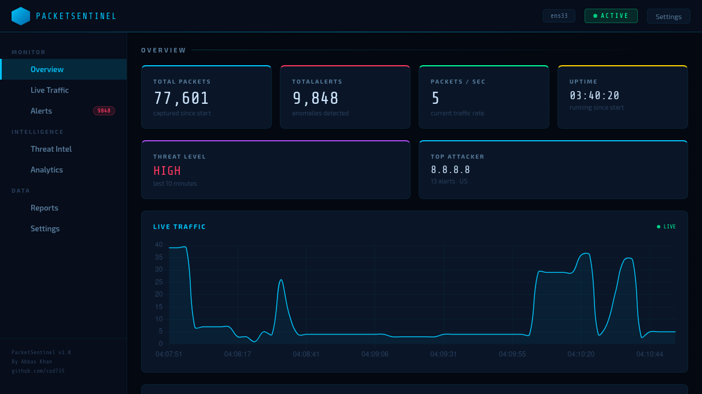

# PacketSentinel

**Real-time Network Traffic Monitor & Anomaly Detector**


---

## Dashboard



---

## Overview

PacketSentinel is a standalone network traffic monitor and anomaly detection system built for Linux. It captures live packets from your network interface, learns your normal traffic baseline, and alerts you when something suspicious is detected.

Built as part of a cybersecurity portfolio — designed to demonstrate real-world security engineering skills including packet analysis, threat detection, REST API design, and SOC dashboard development.

---

## Features

- Smart Baseline Learning — Learns your normal traffic before alerting (no false positives from day one)
- 4 Detection Rules — Port scan, bandwidth spike, suspicious IP, protocol anomaly
- GeoIP Enrichment — Every alert shows the source country using MaxMind GeoLite2
- Alert Severity — LOW / MEDIUM / HIGH / CRITICAL with color coding
- SOC Dashboard — Professional dark-themed web UI at localhost:5001
- Live Charts — Real-time traffic visualization with Chart.js
- Alert Management — Search, filter, click for details, block IPs
- Export — Download alerts as CSV or JSON
- Auto-installer — One command setup with systemd service
- Portable — Auto-detects network interface on any Linux machine

---

## Detection Rules

| Rule | Trigger | Severity |
|---|---|---|
| Port Scan Detector | 15+ unique ports from same IP in 10 seconds | MEDIUM / HIGH |
| Bandwidth Spike | Traffic exceeds 6x learned baseline | HIGH |
| Suspicious IP | Matches blocklist or high-risk country (GeoIP) | CRITICAL / HIGH |
| Protocol Anomaly | Wrong protocol on known port (e.g. SSH on port 80) | MEDIUM |

---

## Architecture

```
PacketSentinel/
├── core/
│   ├── baseline.py      # Smart traffic baseline learning engine
│   ├── geoip.py         # MaxMind GeoIP country lookup
│   ├── detector.py      # 4 detection rules engine
│   └── sniffer.py       # Live packet capture (scapy)
├── dashboard/
│   ├── app.py           # Flask REST API (9 endpoints)
│   └── templates/
│       └── index.html   # Full SOC dashboard UI
├── data/
│   ├── alerts.db        # SQLite alerts database
│   ├── blocklist.txt    # Known bad IPs
│   └── GeoLite2-Country.mmdb
├── config.py            # Central configuration
├── main.py              # Entry point
├── install.sh           # Auto installer
└── uninstall.sh         # Clean uninstaller
```

---

## Quick Start

### Option 1 — Auto Install (Recommended)

```bash
git clone https://github.com/cod735/PacketSentinel.git
cd PacketSentinel
sudo bash install.sh
```

Then open: http://localhost:5001

---

### Option 2 — Manual Install

**1. Clone the repository**
```bash
git clone https://github.com/cod735/PacketSentinel.git
cd PacketSentinel
```

**2. Create virtual environment**
```bash
python3 -m venv venv
source venv/bin/activate
```

**3. Install dependencies**
```bash
pip install flask scapy geoip2 requests netifaces
```

**4. Download GeoIP database**
```bash
wget -O data/GeoLite2-Country.mmdb \
  "https://github.com/P3TERX/GeoLite.mmdb/raw/download/GeoLite2-Country.mmdb"
```

**5. Run PacketSentinel**
```bash
sudo venv/bin/python3 main.py
```

**6. Open dashboard**
```
http://localhost:5001
```

---

## Testing Detection Rules

### Test 1 — Port Scan
```bash
sudo venv/bin/python3 -c "
from scapy.all import *
import time
for port in range(1, 60):
    send(IP(src='10.0.0.99', dst='YOUR_IP')/TCP(dport=port, flags='S'), verbose=False)
    time.sleep(0.1)
"
```

### Test 2 — Suspicious IP
```bash
sudo venv/bin/python3 -c "
from scapy.all import *
send(IP(src='185.220.101.1', dst='YOUR_IP')/TCP(dport=80), count=5)
"
```

### Test 3 — Protocol Anomaly
```bash
sudo venv/bin/python3 -c "
from scapy.all import *
send(IP(src='1.2.3.4', dst='YOUR_IP')/TCP(dport=80)/Raw(load='SSH-2.0-OpenSSH'), count=5)
"
```

---

## API Endpoints

| Endpoint | Method | Description |
|---|---|---|
| `/` | GET | SOC Dashboard UI |
| `/api/alerts` | GET | Latest alerts (filter by severity, search) |
| `/api/stats` | GET | Live traffic statistics |
| `/api/traffic` | GET | 60-second traffic timeline |
| `/api/threat-intel` | GET | Top countries and IPs |
| `/api/analytics` | GET | Charts data (time, types, severity) |
| `/api/export/csv` | GET | Download alerts as CSV |
| `/api/export/json` | GET | Download alerts as JSON |
| `/api/blocklist/add` | POST | Block an IP address |

---

## Configuration

All settings are in `config.py`:

```python
BASELINE_DURATION          = 180    # Learning window (seconds)
BANDWIDTH_SPIKE_MULTIPLIER = 6.0    # Spike sensitivity
PORT_SCAN_THRESHOLD        = 15     # Unique ports before alert
PORT_SCAN_WINDOW           = 10     # Detection window (seconds)
FLASK_PORT                 = 5001   # Dashboard port
```

---

## Service Management

```bash
# Status
systemctl status packetsentinel

# Stop
systemctl stop packetsentinel

# Restart
systemctl restart packetsentinel

# View logs
tail -f packetsentinel.log

# Uninstall
sudo bash uninstall.sh
```

---

## Tech Stack

| Component | Technology |
|---|---|
| Packet Capture | Scapy 2.7 |
| Web Framework | Flask 3.1 |
| Database | SQLite3 |
| GeoIP | MaxMind GeoLite2 |
| Charts | Chart.js 4.4 |
| Interface Detection | netifaces |
| Service Manager | systemd |

---

## Roadmap

- [ ] ShieldLog SIEM integration
- [ ] Email / Slack alert notifications
- [ ] PDF report generation
- [ ] Docker container support
- [ ] Custom detection rules via config
- [ ] IPv6 support

---

## Author

**Abbas Khan**
- GitHub: [@cod735](https://github.com/cod735)

---

## License

MIT License — free to use, modify and distribute.

---

## Disclaimer

PacketSentinel is built for educational and authorized network monitoring purposes only. Only use it on networks you own or have explicit permission to monitor. Unauthorized network monitoring may be illegal in your jurisdiction.